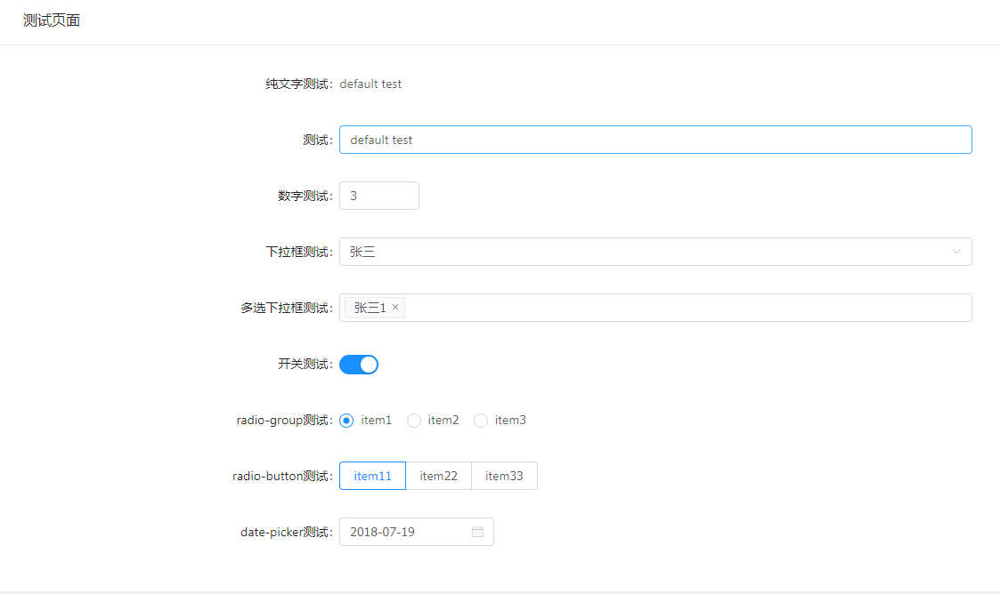

# 应用配置页面

## 使用规则

为了配置 app 应用，主要分为两块配置:

1. 应用规则配置
2. 应用生成配置

其中*应用规则配置*为**输入配置**，用于生成配置页面、页面表单，通常有接口拿到该数据或是本地一个 `json` 数据，较少改动。
*应用生成配置*为**输出配置**，用于在该*应用规则配置*下生成的对应的实际配置，这里生成的配置一般就是所需要的配置。

### 应用规则配置

应用规则配置实质上就是对**配置页面有哪些具体配置**的一个配置，包括有哪些应用可以被配置、该应用下又有哪些**字段**可以被配置、以及该字段的默认值设置和值的不同表单形式展现。


针对应用规则配置的 `json` 文件而言，有几个 `key` 需要说明（可以在 `./server/data/page-config.json` 查看该类配置实例，实际情况是此处配置文件由接口得到）：

```json
{
  "readerCenter": {
    "name": "读者中心",
    "version": "1.0.0",
    "description": "请对读者中心应用的选项进行配置",
    "children": [
      {
        "name": "基本配置",
        "fields": "baseInfo",
        "rules": [
          {
            "name": "基本信息",
            "fields": "infos",
            "isRequired": false,
            "type": "input",
            "defaultValue": "default infos"
          }
        ]
      },
      {
          "name": "个人信息",
          "fields": "userInfo",
          "rules": [
            {
              "name": "账号",
              "fields": "username",
              "isRequired": false,
              "type": "input",
              "defaultValue": "default username"
            },
            {
              "name": "密码",
              "fields": "password",
              "isRequired": true,
              "type": "input",
              "defaultValue": "default password"
            },
            {
              "name": "密码2",
              "fields": "password333",
              "isRequired": true,
              "type": "input",
              "defaultValue": "default password"
            }
          ]
      }
    ]
  }
}
```

这里将应用配置分为三层，最外层是*应用级别*，如上面 `json` 中的 `readerCenter` 作为*应用级别*层。
*应用级别层*下有 `children` 作为该*应用级别层* 下的*子配置层*，用于分割一个大型应用配置，将一个复杂的*应用级别配置*分割成多个*子配置层*。
*子配置层*下有 `rules` 字段，作为*具体配置层*，这是不可细分一层，也是最实际业务所需的配置设置。

* "readerCenter" **必须**，,表明该应用的名称，*应用级别层*的区分，内部会用该字段涉及到相关路由，不能重复
  * "name" **必须**，应用中文名，会在配置页面中显示该中文名
  * "version" 版本号，暂时没有作用
  * "description" 应用描述，用于在页面局部显示
  * "children" **必须**，该*应用级别层*下的*子配置层*，接收一个数组
    * "name" **必须**，子配置名称，在配置页面显示该子配置名称
    * "fields" **必须**，该子配置下的字段名称
    * "rules" **必须**，*子配置层*下的*具体配置层*，很重要，具体细节下面详细说
    
#### `rules` 配置项设置

`rules` 接收一个数组格式:

* "name" `{@type=String}` `{@defaultValue=""}` **必须**，注明该配置项的名称
* "fields" `{@type=String}` `{@defaultValue=""}` **必须**，注明该配置项实际字段名称
* "isRequired" `{@type=Boolean}` `{@defaultValue=false}` 注明该字段是否为必须项
* "requiredMessage"  `{@type=String}` `{@defaultValue="输入必选项"}` 注明未填写时，提示报错文字
* "type" `{@type=Enum<input, input-number, select, select-multiple, switch, radio-group, radio-button, date-picker, text>}` `{@defaultValue=""}` **必须**，注明该配置项展示表单形式
* "defaultValue" `{@type=Any}` 注明该配置项的默认值，依据 `type` 类型给定指定默认值

这里的 `type` 属性提供了 [`antd`](https://ant.design/components/form-cn/) 组件库有的几种表单组件,具体如下: 

1. "input" 输入框
2. "input-number" 数字输入框，此时，在同级上新增接受两个参数：
    * "min" `{@type=Number}` `{@defaultValue=0}` 数字输入框的最小值
    * "max" `{@type=Number}` `{@defaultValue=10}` 数字输入框的最大值
3. "select" 下拉框，此时，在同级上新增接受一个参数，注意此时传入的 `defaultValue` 应保持和 `selectValue` 中的 `value` 一致：
    * selectValue `{@type=Array}` `{@defaultValue=null}` 下拉框的可选项, `selectValue` 接受如下参数:
        * "displayValue" `{@type=String}` 下拉框选项显示值
        * "value" `{@type=String}` 下拉框实际返回值
        * "defaulted" `{@type=Boolean}` 是否默认选中该项
4. "select-multiple" 多选下拉框，参考 `select` 的参数
5. "switch" 开关
6. "radio-group" 单选框，功能和 `select` 类似，参数也和 `select` 类似
7. "radio-button" 单选按钮，功能和 `radio-group` 类似，参数参考 `radio-group`
8. "date-picker" 日期选择器，注意：传入的 `defaultValue` 的格式必须类似于 `"2018-07-15"`，月份和日期需补足两位
9. "text" 纯文字显示

具体表单组件展示如图：



### 应用生成配置

根据当前的*应用规则配置*生成的表单页面中，更改表单内容生成**实际业务所需要的配置**。
这里可以参考 `./server/data/config.json` 生成的一个配置实例：

```json
{
  "readerCenter": {
    "basicConfig": {
      "show": true
    },
    "subConfig": {
      "baseInfo": {},
      "userInfo": {
        "username": "432423",
        "password": "321321",
        "password333": "543534"
      },
      "test": {
        "test": "default test"
      }
    }
  }
}
```

这个 `json` 针对 `readerCenter` 这个应用生成对应的配置：

* "readerCenter" 注明*应用级别层*名称
    * "basicConfig" *应用级别层*的全局配置，暂时只有 `show` 一个字段可配置，后续可增加其他全局配置
        * "show" 固定一个的字段，表明该应用是否启用
    * "subConfig" 应用规则，内部的字段以及字段的值，由*应用规则配置*中*子配置*的 `fields` 以及*子配置*下的*实际配置层*的 `fields` 所控制。
    
## 项目细节

整体思路是，通过**接口**去接收一个*应用规则配置*，通过该*应用规则配置*去生成一个*应用生成配置*。
为了更好的本地开发，在 `./server` 下有一个简单的 `api` 服务，接收 `./server/data/page-config.json` 中的 `json` 数据作为 *应用规则配置*，生成的*应用生成配置*写到了 `./server/data/config.json` 中。

### 如何开始

```bash
# 依赖安装
npm i

# 本地api服务启动
node server

# 前端项目启动
npm start
```
